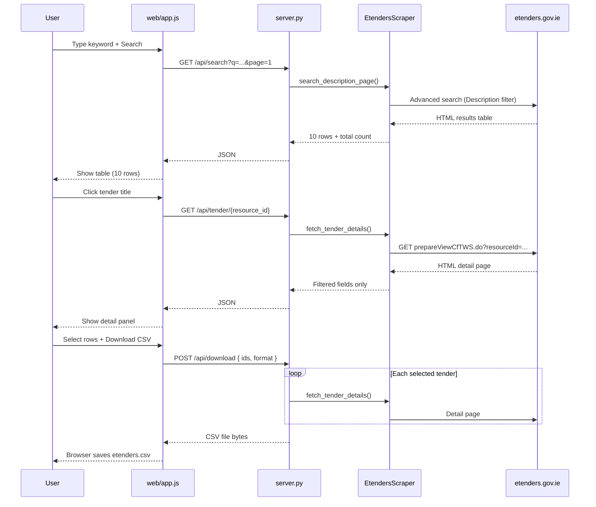

# How this project works

This document explains the **full logic** behind the eTenders scraper: what each part does, how data moves from your search word to a CSV/Excel file, and how the code talks to [etenders.gov.ie](https://www.etenders.gov.ie).

---

## 1. What the project does (in one sentence)

You type a keyword → the app searches Irish public tenders by **Description** on eTenders → you see **10 results per page** → you select tenders → you download **CSV or Excel** with specific fields taken from each tender’s detail page.

---

## 2. Why there are two layers (browser + Python)

| Layer | Role |
|--------|------|
| **`web/`** (HTML, CSS, JavaScript) | What you see and click: search box, table, checkboxes, download buttons. |
| **`server.py` + `etenders_scraper/`** (Python) | Talks to eTenders over HTTP, parses HTML, builds files. |

The browser **cannot** call eTenders directly (cross-origin / CORS). So a small **Flask server** on your machine (`http://localhost:8092`) acts as a bridge:

```
Browser (web/app.js)  →  Flask API (server.py)  →  eTenders.gov.ie
```

---

## 3. Project structure

```
etenders-scraper/
├── server.py              # Flask app: API routes + file download
├── web/
│   ├── index.html         # Page layout
│   ├── styles.css         # Visual design
│   └── app.js             # UI logic (search, pagination, select, download)
├── etenders_scraper/      # Scraping library (reusable)
│   ├── client.py          # HTTP session + rate limiting
│   ├── scraper.py         # Search, pagination, detail fetch
│   ├── parser.py          # HTML → structured rows / fields
│   ├── filters.py         # Map "description" → real form field names
│   └── fields.py          # CfT workspace label parsing + export order
├── scrape.py              # Optional CLI (no UI)
├── requirements.txt
└── README.md
```

---

## 4. End-to-end user flow



### Step by step

1. **Search** — Only the **Description** field on eTenders advanced search is filled with your keyword.
2. **List** — The results table is parsed from HTML (title, resource ID, authority, dates, status, etc.).
3. **Paginate** — Each UI page loads **10 tenders** (`PAGE_SIZE = 10` in `server.py`).
4. **Preview** — Clicking a title loads **one tender’s detail page** and shows only the fields you asked for (see section 8).
5. **Export** — Selected `resource_id`s are sent to the server; for each ID the detail page is fetched again and written to CSV/Excel with **professional column headers** and **hyperlinks** where applicable.

---

## 5. How eTenders is contacted

Base URL: `https://www.etenders.gov.ie/epps/`

| Step | URL / action | Purpose |
|------|----------------|---------|
| Load search form | `prepareAdvancedSearch.do?type=cftFTS` | Get the advanced search form and all hidden fields |
| Submit search | `advancedSearchAction.do` (GET or POST — detected from form) | Run search with Description filled in |
| Results pages | Same action + pagination params | Next/previous 10 results |
| Tender detail | `cft/prepareViewCfTWS.do?resourceId={id}` | Full CfT workspace page for one tender |

Important query/body parameters:

| Parameter | Meaning |
|-----------|---------|
| `type=cftFTS` | Call for Tenders search type |
| `T01_ps=10` | **Page size** (10 rows per page in the UI) |
| `d-{token}-p=N` | **Page number** (DisplayTag pagination; `token` is parsed from HTML, e.g. `3680175`) |

The scraper keeps a **`requests.Session()`** so cookies from the first search request are reused when loading page 2, 3, etc.

---

## 6. Core Python modules

### 6.1 `client.py` — HTTP

- One shared session per scraper instance.
- Adds a normal browser `User-Agent`.
- **Rate limiting** (`delay_seconds`, default ~0.8–1s between requests) to avoid hammering the site.

### 6.2 `filters.py` — Search filters

eTenders form fields have internal names like `cftDescription` (they can change). This module:

- Defines logical names (`description`, `title`, …).
- **`apply_filters()`** finds the real `<input>` / `<textarea>` name by matching hints (e.g. name contains `"description"`).
- Fills only the fields you set; leaves the rest as the form defaults.

The **web UI** only uses `SearchFilters(description=query)`.

### 6.3 `parser.py` — HTML → data

| Function | Input | Output |
|----------|--------|--------|
| `parse_form_fields()` | Advanced search HTML | Form method, action URL, default field values |
| `parse_search_rows()` | Results HTML | List of dicts (title, resource_id, deadlines, …) |
| `parse_results_summary()` | Results HTML | `{ start, end, total }` e.g. "Displaying: 1-10 \| 500 results" |
| `extract_pagination_token()` | Results HTML | DisplayTag id for `d-{id}-p` |
| `parse_detail_fields()` | Detail page HTML | Dict of label → value |

Results table: finds the largest HTML `<table>` with data rows, reads header cells, maps each `<tr>` to a dictionary. Builds `detail_url` from links or from `resource_id`.

### 6.4 `fields.py` — Detail page text

CfT workspace pages show fields as continuous text:

`Description: … Procurement Type: Services Estimated value (EUR): …`

`parse_cft_workspace_text()` splits on a known list of **labels** (`CFT_WORKSPACE_LABELS`) and converts them to keys like `description`, `procurement_type`, `estimated_value_eur`.

### 6.5 `scraper.py` — Orchestration

Main class: **`EtendersScraper`**

| Method | Used by | What it does |
|--------|---------|----------------|
| `search_description_page(q, page)` | Web API `/api/search` | One page of description search (10 rows) |
| `fetch_tender_details(rows)` | `/api/tender`, `/api/download` | GET each `prepareViewCfTWS.do` and parse fields |
| `scrape_advanced()` / `iter_advanced()` | CLI `scrape.py` | Multi-page advanced search |
| `scrape_list()` | CLI | Unfiltered quick listing |

**Advanced search pagination** stores `_SearchContext` (method, action, payload) so page 2+ uses the **same** search, not the generic quick-search URL.

Flow inside `search_description_page`:

1. GET advanced search form.
2. Parse form → build payload with description + `T01_ps=10`.
3. POST/GET search action → HTML page 1.
4. If `page > 1`, repeat request with `d-{token}-p=page`.
5. `parse_search_rows()` → return rows + summary.

### 6.6 `server.py` — API + export

| Route | Method | Body / query | Response |
|-------|--------|--------------|----------|
| `/` | GET | — | `index.html` |
| `/api/search` | GET | `q`, `page` | JSON: rows, total, pageSize |
| `/api/tender/<id>` | GET | — | JSON: selected detail fields only |
| `/api/download` | POST | `{ ids: [...], format: "csv"\|"xlsx" }` | File download |

**Export columns** are fixed in `DETAIL_FIELDS` / `DETAIL_KEYS`. Human-readable headers come from `HEADER_LABELS` (e.g. `resource_id` → **Resource ID**).

- **CSV**: UTF-8 with BOM; header row uses friendly names.
- **Excel**: `openpyxl`; `detail_url` and TED links get real **hyperlinks** when the cell value is a URL.

---

## 7. Frontend logic (`web/app.js`)

State object:

```javascript
{
  q: "",           // current search keyword
  page: 1,         // current results page
  total: null,     // total matches from eTenders
  rows: [],        // 10 tenders on this page
  selected: Set(), // resource_id strings selected for export
}
```

| User action | Code behavior |
|-------------|----------------|
| Search | `GET /api/search?q=...&page=1`, reset selection |
| Prev / Next | Change `page`, call `/api/search` again |
| Select all on page | Add/remove all 10 `resource_id`s on current page |
| Click title | `GET /api/tender/{id}`, render detail panel |
| Download CSV/Excel | `POST /api/download`, trigger browser download from blob |

Selection is **per resource ID**, so you can select on page 1, go to page 2, select more, and export all selected IDs in one file.

---

## 8. Which fields are loaded and exported

Only these are read from the **tender detail page** (CfT workspace):

1. Description  
2. Procurement Type  
3. Estimated value (EUR)  
4. Time-limit for receipt of tenders or requests to participate  
5. Deadline for dispatching invitations  
6. End of clarification period  
7. Tenders Opening Date  
8. Allow suppliers to make an online Expression Of Interest  
9. Contract awarded in Lots  
10. Contract duration in months or years, including any options and renewals  
11. Validity of Tender in days or months  
12. Multiple tenders will be accepted  
13. EU funding  
14. Date of Publication/Invitation  
15. TED links for published notices  

Plus for export:

- **Resource ID**  
- **Tender URL** (`detail_url`)

The **list table** still shows summary columns from the search results (title, authority, published date, deadline, status) for browsing; the **download file** uses the detail fields above.

---

## 9. Optional CLI (`scrape.py`)

Same scraping library, no browser:

```powershell
python scrape.py advanced --description "software" --max-pages 5 -o output\tenders.csv
```

Useful for scripts or automation. The **web UI** is the main path described in `README.md`.

---

## 10. Running the app

```bash
cd Tender_project
# Activate the virtual environment (if on Windows PowerShell)
.\.venv\Scripts\Activate.ps1
# (or source .venv/bin/activate on Bash/macOS/Linux)

pip install -r requirements.txt
python server.py
```

Open **http://localhost:8092**.

`server.py` serves static files from `web/` and registers the API routes. Flask’s dev server is used for local use (`app.run` on port 8092).

---

## 11. Limitations and behaviour to know

| Topic | Behaviour |
|-------|-----------|
| **No official API** | Everything is HTML scraping; site layout changes may require parser updates. |
| **Speed** | Export fetches one HTTP request per selected tender (polite delay between calls). |
| **Search** | Description filter only in the UI; CLI supports more filters via `SearchFilters`. |
| **Pagination token** | Parsed from HTML (`d-3680175-p` style); if eTenders changes markup, pagination may break. |
| **Legal / etiquette** | Use reasonable delays; check eTenders terms for bulk automated access. |

---

## 12. Quick reference: file → responsibility

| If you want to change… | Edit… |
|------------------------|--------|
| Page size (10 per page) | `PAGE_SIZE` in `server.py` |
| Which fields are exported | `DETAIL_FIELDS` in `server.py` |
| CSV column titles | `HEADER_LABELS` in `server.py` |
| Search / pagination logic | `etenders_scraper/scraper.py` |
| How HTML tables are parsed | `etenders_scraper/parser.py` |
| Detail page label parsing | `etenders_scraper/fields.py` |
| UI layout / colours | `web/index.html`, `web/styles.css` |
| Buttons, API calls, selection | `web/app.js` |

---

## 13. Data shape examples

**Search result row** (from list):

```json
{
  "title": "Provision of Board Secretariat Services",
  "resource_id": "8292987",
  "contracting_authority": "Digital Manufacturing Ireland",
  "date_published": "02/06/2026 09:53:17",
  "submission_deadline": "03/07/2026 12:00:00",
  "procedure": "Open",
  "status": "Tender Submission",
  "detail_url": "https://www.etenders.gov.ie/epps/cft/prepareViewCfTWS.do?resourceId=8292987"
}
```

**Detail response** (subset):

```json
{
  "resource_id": "8292987",
  "description": "The appointed service provider will deliver...",
  "procurement_type": "Services",
  "estimated_value_eur": "163,800",
  "detail_url": "https://www.etenders.gov.ie/epps/cft/prepareViewCfTWS.do?resourceId=8292987"
}
```

**CSV header row** (friendly names, not `resource_id`):

```text
Resource ID,Tender URL,Description,Procurement Type,Estimated Value (EUR),...
```

---

*This project is unofficial and not affiliated with the Irish Government or European Dynamics (eTenders operator).*
