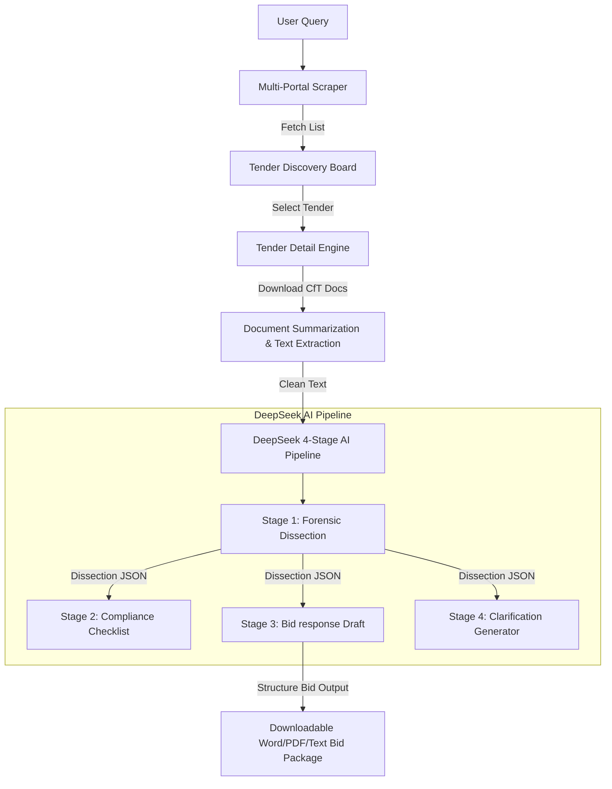

# TenderFlow AI-Powered Procurement & Bid Assistant Methodology

This document outlines the detailed system architecture, data flow, and algorithmic methodology powering the **TenderFlow** platform, with a focus on the integration of the **DeepSeek AI API** for tender analysis and automated bid response generation.

---

## 1. System Overview

TenderFlow is an end-to-end procurement intelligence platform designed to automate the discovery of public sector tenders across the UK and Ireland and streamline the submission writing process. The platform is structured around three core pillars:
1. **Multi-Portal Discovery Engine**: Direct web scrapers for Ireland eTenders, Public Contracts Scotland, Sell2Wales, and eTenders NI.
2. **DeepSeek AI Pipeline**: A multi-stage chained LLM orchestrator that handles tender dissection, compliance checklist generation, full-text bid drafting, and strategic clarification preparation.
3. **Enterprise Core**: User management, database isolation, granular credit metering, and Stripe-based billing.



---

## 2. Multi-Portal Scraper Design & Data Ingestion

The platform retrieves tender listings and tender documents from multiple official government procurement portals.

### 2.1 Web Scraping Strategy
Since many government portals lack open APIs, TenderFlow implements customized Python-based scrapers using `requests.Session()` to handle cookies, session state, and stateful pagination tokens.
- **Ireland eTenders**: Queries the advanced search page (`prepareAdvancedSearch.do?type=cftFTS`), parses form payloads, extracts the dynamic DisplayTag pagination token (e.g., `d-3680175-p`), and scrapes tables page-by-page.
- **UK/Scotland/Wales Portals**: Aggregates listings from Public Contracts Scotland, Sell2Wales, and eTenders NI. It handles portal-specific table layouts, normalizing date formats, status indicators, and deadlines into a single, unified database schema.

### 2.2 Extraction & Chunking Strategy
Tender detail pages (Call for Tender workspaces) and document attachments (PDFs, DOCXs, TXTs) are downloaded and extracted:
1. **File Parsing**: Converts binaries to plain text.
2. **Text Normalization**: Strips excessive whitespaces, headers, and footers while preserving list bullets and key clause markers.
3. **Smart Ingestion Limit**: Because LLM context windows are bounded, TenderFlow uses a `smart_chunk` utility to cap inputs at 180,000 characters (~45,000 tokens). If documents exceed this threshold, it triggers a pre-summarization pass (`summarise_single_doc`) where each document is individually summarized by DeepSeek, retaining key evaluation criteria, requirements, and compliance parameters before passing the merged summary to the main pipeline.

---

## 3. The Chained DeepSeek AI Pipeline (`run_bid_pipeline`)

The core value proposition of TenderFlow is its **4-Stage Chained AI Pipeline**. Rather than asking the LLM to write a bid response in a single, unconstrained prompt (which leads to hallucinations, generic content, and formatting failures), TenderFlow uses a sequential pipeline where each stage's output feeds the next.

```
┌──────────────────────────────────┐
│ Stage 1: Forensic Dissection     │
└────────────────┬─────────────────┘
                 │ (JSON Dissection)
                 ▼
┌──────────────────────────────────┐
│ Stage 2: Compliance Checklist    │
└────────────────┬─────────────────┘
                 │ (JSON Dissection + Bidder Profile)
                 ▼
┌──────────────────────────────────┐
│ Stage 3: Bid Response Drafting   │
└────────────────┬─────────────────┘
                 │ (JSON Dissection)
                 ▼
┌──────────────────────────────────┐
│ Stage 4: Clarification Strategy  │
└──────────────────────────────────┘
```

### 3.1 Stage 1: Forensic Dissection
- **Objective**: Parse raw tender documents and extract structural fields into a strictly validated JSON object.
- **LLM Settings**: `model="deepseek-chat"`, `temperature=0.3`, `response_format={"type": "json_object"}`.
- **System Instructions**: The model acts as a senior public procurement analyst with 15 years of experience. It is strictly forbidden to invent, infer, or assume requirements.
- **Output JSON Schema**:
  ```json
  {
    "tender_reference": "string",
    "tender_title": "string",
    "contracting_authority": "string",
    "contract_value": { "estimated": "string", "currency": "string", "vat_inclusive": "boolean" },
    "submission_deadline": { "date": "string", "time": "string", "timezone": "string", "portal": "string" },
    "evaluation_criteria": [
      { "criterion": "string", "weighting_percent": "number", "type": "Quality/Price/Pass-Fail", "sub_criteria": [], "scoring_method": "string" }
    ],
    "scope_of_work": { "summary": "string", "full_scope": "string", "key_deliverables": [] },
    "itt_questions": [
      { "number": "string", "question_text": "string", "word_limit": "number", "mandatory": "boolean" }
    ],
    "mandatory_requirements": [
      { "requirement": "string", "consequence_of_failure": "string", "evidence_required": "string" }
    ],
    "insurance_requirements": [
      { "type": "string", "minimum_value": "string", "mandatory": "boolean" }
    ],
    "financial_requirements": [
      { "requirement": "string", "evidence": "string", "threshold": "string" }
    ],
    "social_value_requirements": { "required": "boolean", "weighting": "string", "themes": [] }
  }
  ```

### 3.2 Stage 2: Compliance & Action Checklist
- **Objective**: Translate raw requirements from Stage 1 into an actionable list of tasks for the bidding team.
- **LLM Settings**: `model="deepseek-chat"`, `temperature=0.3`, `response_format={"type": "json_object"}`.
- **Inputs**: Output of Stage 1 + Bidder's Company Name.
- **Logic**: Iterates over requirements to tag them into categories (`FORM`, `CERTIFICATE`, `INSURANCE`, `FINANCIAL`, `POLICY`, etc.), flags whether the item requires a signature, assesses estimated effort, and determines if the item can be drafted by AI (e.g., standard policies) or requires physical documents (e.g., ISO Certificates).

### 3.3 Stage 3: Bid Response Writing
- **Objective**: Generate a highly professional, compliant, and structured draft of the full bid response.
- **LLM Settings**: `model="deepseek-chat"`, `temperature=0.3`, `response_format={"type": "json_object"}`.
- **Inputs**: Stage 1 JSON + Bidder Profile + Answer Bank (verified company case studies and policies).
- **Core Guidelines**:
  1. **Compliance First**: Every response begins with a direct compliance statement mirroring the buyer's criteria.
  2. **Answer Bank Injection**: Pre-approved case studies and answers are inserted verbatim, ensuring zero hallucinations for factual corporate history.
  3. **Strict Constraints**: Stated word/page limits are adhered to.
  4. **Smart Placeholders**: Any missing company information is marked with a standard tag: `[PLACEHOLDER: Description of information needed]`.
- **Output Components**:
  - Addressed Cover Letter (400-500 words)
  - Executive Summary (500-700 words)
  - Technical Methodology (800-1200 words)
  - Direct ITT Question Responses (mapping to every question in Stage 1)
  - Team & Personnel Profiles
  - Social Value Alignment

### 3.4 Stage 4: Clarification Generator
- **Objective**: Identify ambiguities or gaps in the tender documents and draft formal questions to submit to the buyer.
- **LLM Settings**: `model="deepseek-chat"`, `temperature=0.3`, `response_format={"type": "json_object"}`.
- **Logic**: Scrapes the Stage 1 dissection specifically looking for conflicting clauses, missing details, or vague evaluation methodologies, and produces professionally formatted questions categorized by priority (`CRITICAL`, `HIGH`, `MEDIUM`).

---

## 4. Fit Scoring Methodology

To help users decide which tenders to pursue, TenderFlow calculates a two-tiered **Fit Score** (0 to 100).

```
┌────────────────────────────────────────────────────────────────┐
│                   TOTAL FIT SCORE (0 - 100)                    │
├───────────────────────────────┬────────────────────────────────┤
│    Tier 1: Rules-Based (40%)  │      Tier 2: AI-Driven (60%)   │
├───────────────────────────────┼────────────────────────────────┤
│ - Geography / Location Match  │ - Capability Gap Analysis      │
│ - Financial Suitability       │ - Historical Past Performance  │
│ - Sector (CPV / NACE) Code    │ - SWOT & Risk Identification   │
│ - Timeline / Deadline Margin  │ - Strategic Advantage Check    │
└───────────────────────────────┴────────────────────────────────┘
```

1. **Tier 1: Rules-Based Quick Fit (40% Weight)**
   - Executed instantly on search results.
   - **Financial Thresholds**: Compares the bidder's annual turnover with the estimated tender value (disincentivizing bidding on contracts that exceed 50% of the company's revenue).
   - **Geographic Match**: Checks bidder's registered offices against delivery NUTS codes.
   - **Sector Codes**: Checks CPV classification matching.
   - **Timeline Check**: Flags tenders with less than 7 days remaining.

2. **Tier 2: AI-Driven Deep Fit (60% Weight)**
   - Triggered when a user clicks a tender and requests analysis.
   - DeepSeek compares the bidder's detailed company profile against the scope of work and evaluation criteria to identify capability gaps, SWOT alignment, and risks.
   - Cached in `fit_scores` database table to prevent redundant API calls.

---

## 5. Security, Isolation, & Performance

### 5.1 Robust JSON Healing
Since the DeepSeek model is configured to return JSON, any truncation due to token limits or minor format issues could break the application. TenderFlow implements an advanced `heal_and_parse_json` utility:
- Strips markdown code blocks (` ```json `).
- Automatically escapes unescaped control characters inside string literals (e.g., newlines, tabs).
- Balances open brackets (`{` and `[`), and if necessary, scans backwards to truncate at the last valid comma-separated boundary, ensuring a valid partial JSON object is always returned instead of crashing.

### 5.2 Enterprise Features
- **Data Isolation**: All database operations scope results by `username` session values to ensure total tenant separation.
- **Credit Metering**: Each AI analysis is metered. The `@require_credits` decorator verifies credit balances prior to calling DeepSeek and decrements user balances upon successful pipeline execution.
- **Stripe Hook Integration**: Syncs credit balances dynamically on Stripe invoice payments.
